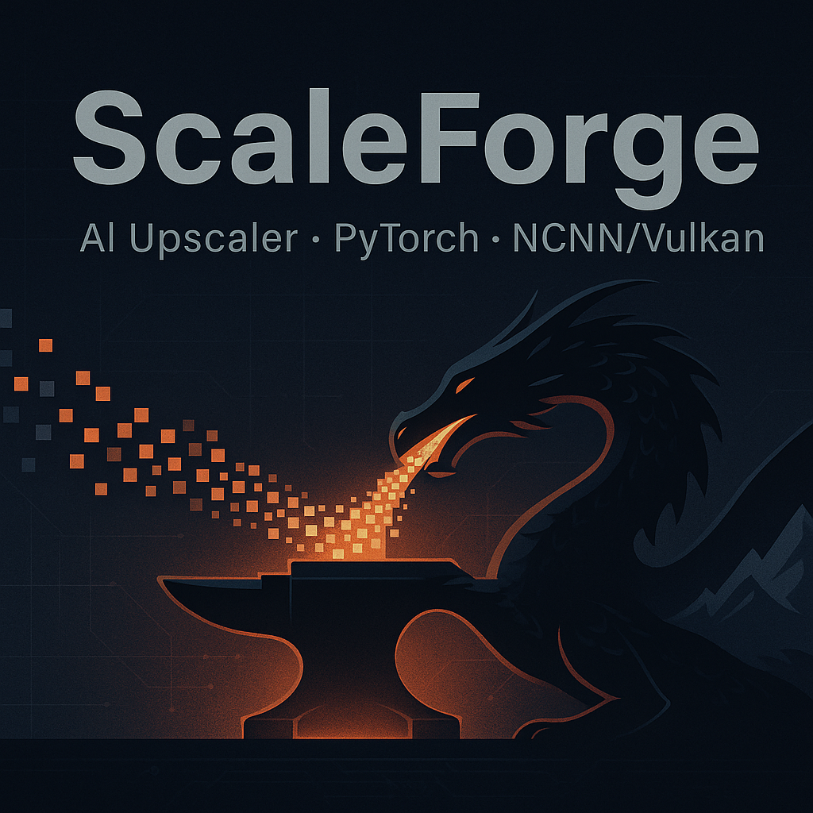
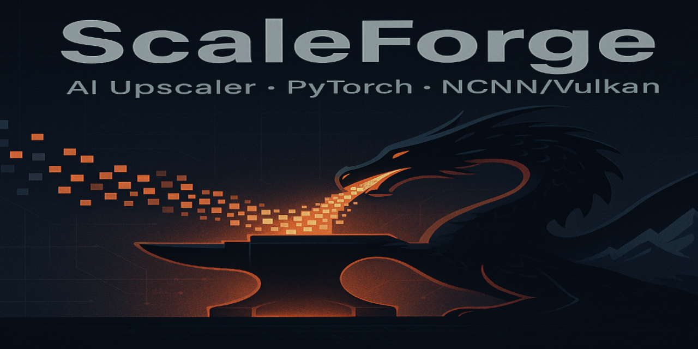

<!-- README banner -->
<p align="center">
  
</p>

# ScaleForge

Fast, portable image upscaler/resizer with smart GPU detection. Core pipeline + simple demos for quick verification.

<p align="center">
  <!-- Optional banner: put an image at assets/brand/banner.png and uncomment -->
  <!--  -->
</p>

[](https://github.com/3-0-0/ScaleForge/actions)
[](https://github.com/3-0-0/ScaleForge/releases)
[](LICENSE)


---

## Why ScaleForge?

- **Smart backend selection** with fallbacks  
  CUDA → ROCm/NCNN/Vulkan → CPU, with a clear decision log.
- **One simple CLI** with a single pipeline.
- **Batteries-included demos** to validate your environment (no GPU toolchains required).
- **Works in a venv**; friendly to CI.

---

## Quick start (from source)

```bash
# 1) Clone and enter
git clone https://github.com/3-0-0/ScaleForge.git
cd ScaleForge

# 2) Create an isolated env (Python 3.10–3.12)
python -m venv .venv
# Linux/macOS
source .venv/bin/activate
# Windows (PowerShell)
# .\.venv\Scripts\Activate.ps1

# 3) Install
pip install -U pip
pip install -e ".[demo]" pytest
````

---

## GPU Detection & Capability Cache

ScaleForge automatically detects your GPU capabilities and caches the results for optimal performance.

* **Cache location**: `${APP_ROOT}/gpu_caps.json`
* **Key information**:

  * GPU vendor (nvidia / amd / intel)
  * Recommended backend (torch-cuda / torch-rocm / torch-cpu / ncnn-vulkan)
  * Performance capabilities (e.g., max tile size, megapixels)
  * Detection timestamp

**Commands**

```bash
# Show current backend choice
scaleforge detect-backend

# Force a fresh probe / show details
scaleforge detect-backend --debug
```

**Environment override**

Set `SCALEFORGE_BACKEND` to force a backend:
`torch-cuda`, `torch-rocm`, `torch-cpu`, `ncnn-vulkan`.

---

## CLI overview

```bash
scaleforge --help
```

Main commands implemented today:

* `detect-backend` — detect/print the selected backend (see above)
* `run` — run the pipeline (options vary by build)
* `demo-upscale` — Pillow-only single image upscale (CPU)
* `demo-batch` — Pillow-only batch upscale (CPU)

---

## Demo (Pillow-only)

A quick CPU-only way to try ScaleForge without GPU toolchains.

```bash
# Single image
python -m scaleforge.cli demo-upscale \
  -i input.png -o out@2x.png -s 2 --mode lanczos

# Batch (filters, suffix, dry-run, overwrite)
python -m scaleforge.cli demo-batch \
  -i ./imgs -o ./out --suffix @2x \
  --include "./imgs/*.png" --exclude "./imgs/skip*.png" \
  --limit 100 --dry-run

# When satisfied, run without --dry-run; add --overwrite to replace existing files.
```

See **[docs/DEMO.md](docs/DEMO.md)** for more examples and notes on `--mode`, `--suffix`, `--include/--exclude`, `--limit`, `--overwrite`, `--dry-run`, and debug output.

---

## Roadmap (short)

* Backend fallback polish & logging ✅
* Demo CLI (`demo-upscale`, `demo-batch`) ✅
* Docs site & richer examples ⏳
* Packaging improvements and presets ⏳

---

## Development

```bash
# Lint / tests (if configured in your environment)
pytest -q
```

Project layout:

```
src/            # library + CLI
tests/          # unit tests (demo tests included)
docs/           # docs/DEMO.md quickstart
```

---

## Contributing

Issues and PRs welcome! Please keep diffs minimal and add tests when behavior changes.

---

# 📜 CREDITS 

## 🧠 Core Contributors

- **300**  
  _Project creator, visionary, and development lead; coordinated AI-agent workflows and oversaw project management._

- **Nexus (ChatGPT)**  
  _Partner AI; architectural co-designer & planner, strategic guidance, troubleshooting, documentation, and quality assurance._  
  → Powered by GPT-5, GPT-4o, GPT-4.5, GPT-4-turbo (o3), and o4-mini-high from [OpenAI](https://openai.com).

- **OpenHands Agent**  
  _Autonomous software engineer; responsible for the majority of the ScaleForge codebase, including initial backend and frontend implementations._  
  → Uses [OpenHands](https://github.com/All-Hands-AI/OpenHands) runtime with GPT APIs to operate independently.

- **Deepseek-Coder**  
  _Auxiliary agent used to reduce compute costs during development._  
  → Powered by [DeepSeek-Coder 1.5](https://github.com/deepseek-ai/DeepSeek-Coder), a distilled model trained on GPT-3.5 and GPT-4 via OpenAI API.

---

## ⚙️ Upstream Projects & Libraries

ScaleForge is made possible by the incredible open-source ecosystem. Huge thanks to the following projects:

### 🔮 Image Upscaling
- [**Real-ESRGAN**](https://github.com/xinntao/Real-ESRGAN) – super-resolution model for photo-realistic image enhancement, by Xintao Wang et al.  
- [**ncnn**](https://github.com/Tencent/ncnn) – fast neural-network inference framework by Tencent.  
- [**PyTorch**](https://pytorch.org/) – deep-learning framework by Meta AI.

### 🖼️ UI / Frontend
- [**Kivy**](https://kivy.org/) – cross-platform UI framework for Python.

### 🧪 Tooling & Developer Experience
- [**ruff**](https://github.com/astral-sh/ruff) – fast Python linter  
- [**black**](https://github.com/psf/black) – Python code formatter  
- [**mypy**](https://github.com/python/mypy) – static type checker  
- [**pytest**](https://pytest.org/) – unit-testing framework  
- [**mkdocs**](https://www.mkdocs.org/) – documentation generator  
- [**mkdocs-material**](https://squidfunk.github.io/mkdocs-material/) – beautiful docs theme  
- [**EditorConfig**](https://editorconfig.org/) – consistent coding styles across editors  

---

## 🤝 Community Contributions
_We welcome feedback, bug reports, and pull requests from the broader community. Join us on GitHub to help improve ScaleForge!_

---

## 🌐 Project Resources
- **GitHub Repository**: [ScaleForge on GitHub](https://github.com/3-0-0/scaleforge)  
- **Documentation**: _(coming soon)_ :contentReference[oaicite:7]{index=7}

---

## 💡 Inspiration
- [**NASA / JWST Wallpapers – Webb Telescope**](https://webbtelescope.org/resource-gallery/images)  
- [**NASA / JWST Wallpapers – Flickr**](https://www.flickr.com/photos/nasawebbtelescope/)  
  The beauty of the cosmos inspired the first use case that led to the creation of ScaleForge.

---

## 🛠️ Infrastructure & CI/CD
- [**GitHub Actions**](https://github.com/features/actions) – continuous integration and delivery

---

## 📄 License
ScaleForge is released under the [MIT License](LICENSE).

---

## 🙏 Thanks
To all maintainers, researchers, and contributors—your dedication makes ScaleForge possible.  
We stand on your shoulders.
